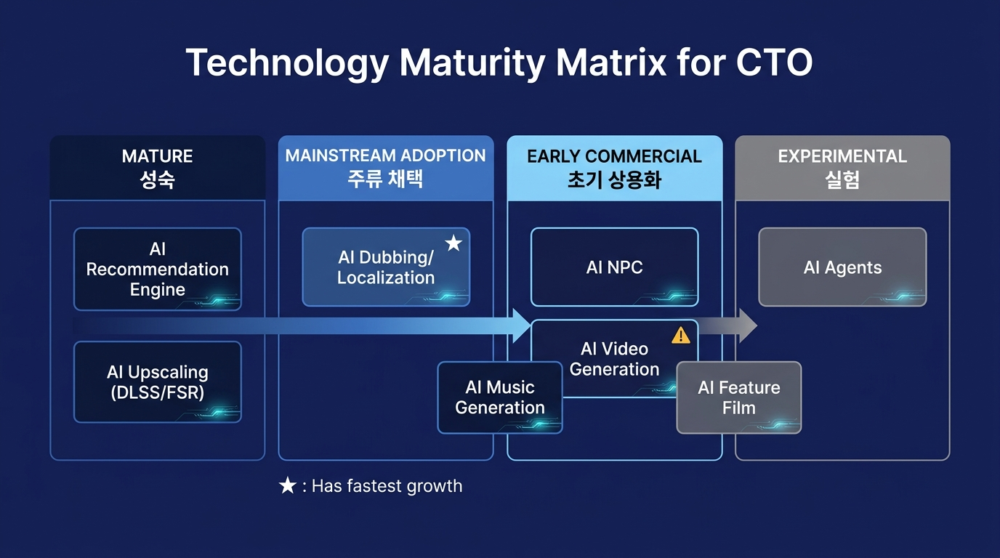
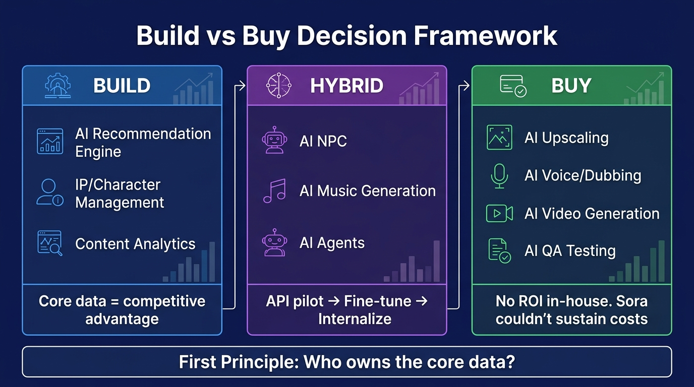
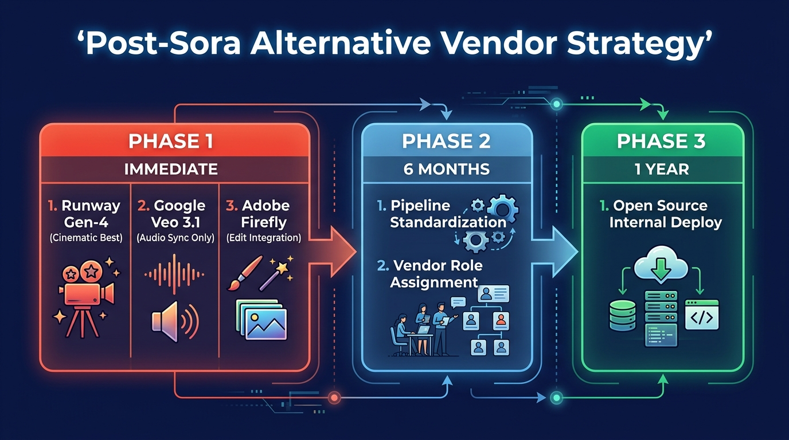
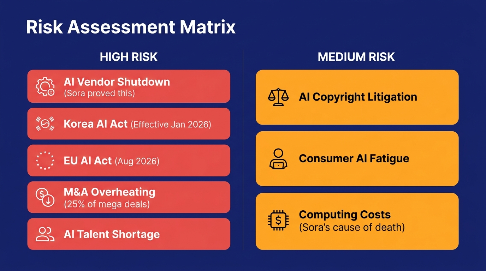
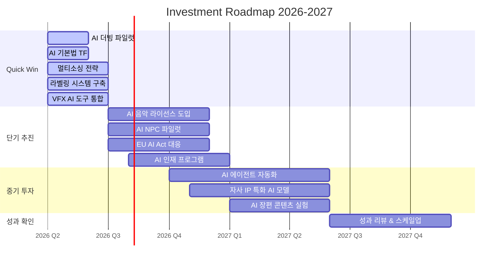
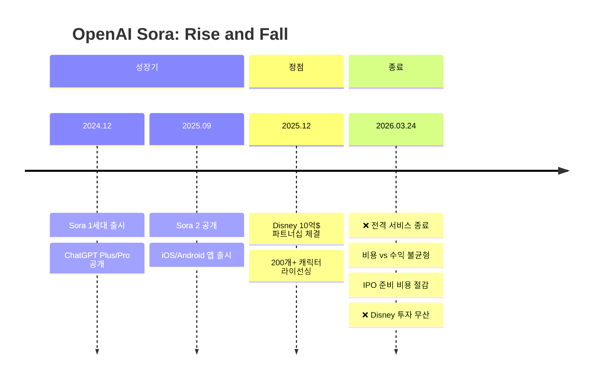

# 엔터테인먼트 산업 AI 활용 현황 및 전략 보고서

> **보고 대상**: CTO / C-Level 경영진
> **작성일**: 2026년 3월 25일
> **분류**: 전략 보고서 (Confidential)
> **버전**: 2.0 (팩트체크·트렌드 업데이트·인사이트 분석 반영)

---

## Executive Summary

**핵심 메시지 3가지:**

1. **시장**: 글로벌 엔터테인먼트 AI 시장은 2024년 **82~260억 달러** 규모이며, 2030년 **995억 달러**(CAGR 24.2%)로 성장 전망 [^1][^2]
2. **전환점**: OpenAI Sora 전격 종료(2026.03)와 AI 음악 라이선스 합의가 시장 구조를 재편 중 — **단일 벤더 의존은 사업 연속성 리스크**
3. **즉시 과제**: 한국 AI 기본법(2026.01 시행)과 EU AI Act(2026.08 시행)에 대한 **컴플라이언스 대응이 긴급**

**필요 의사결정:**
- AI 더빙/로컬라이제이션 파일럿 착수 승인 (Q2)
- AI 기본법 대응 TF 구성 (즉시)
- AI 벤더 멀티소싱 전략 승인

---

## 1. Strategic Context: 시장 환경

### 1.1 글로벌 시장 규모

| 출처 | 2024년 | 2030년 전망 | CAGR |
|------|--------|-----------|------|
| **Grand View Research** | 259.8억$ | 994.8억$ | 24.2% |
| **MarketsandMarkets** | 82.1억$ | 510.8억$ | 35.6% |

> ⚠️ 두 기관의 시장 범위 정의가 상이합니다. GVR은 미디어&엔터 전반의 AI 적용을, MnM은 좁은 정의의 엔터테인먼트 AI를 산정합니다. 의사결정 시 **GVR 기준을 권장**합니다. [^1][^2]

**보조 전망 데이터:**
- **PwC**: AI가 2030년까지 글로벌 GDP에 15.7조 달러 기여, 엔터테인먼트가 주요 수혜 산업 [^3]
- **McKinsey**: 생성형 AI가 미디어/엔터 산업에서 연간 **800억~1,300억 달러** 생산성 향상 가능 [^4]
- **AlixPartners**: 2026년 미디어&엔터 M&A 규모 **800억 달러 이상** 전망, AI 역량이 딜의 25% 차지 [^5]

### 1.2 지역별 시장

| 지역 | 점유율 | CAGR | 핵심 동인 |
|------|--------|------|----------|
| 북미 | ~40% | ~24% | 할리우드 스튜디오, Big Tech(Netflix, Google, Meta) |
| 아시아태평양 | ~30% | ~30%+ | K-콘텐츠, 중국 ByteDance/Tencent, 일본 애니메이션 |
| 유럽 | ~20% | ~22% | EU AI Act 규제 선도, BBC/ITV AI 도입 |

### 1.3 2026 Q1 시장 전환 시그널

| 시그널 | 영향도 | 상세 |
|--------|--------|------|
| 🔴 **Sora 서비스 종료** (2026.03.24) | 극대 | Disney 10억$ 투자 무산, 텍스트-to-비디오 시장 재편 [^6] |
| 🔴 **AI 음악 라이선스 합의** | 극대 | Warner-Suno/Udio 합의, "무단 학습→라이선스" 전환 [^7] |
| 🔴 **ElevenLabs 110억$ 밸류에이션** | 대 | 음성 AI 단일 기업 엔터 AI 최대 규모, Series D $5억 [^8] |
| 🔴 **한국 AI 기본법 시행** (2026.01) | 대 | 아태 최초 포괄 AI 입법, 라벨링 의무 [^9] |
| 🟡 **AI 장편 영화 극장 개봉** | 중 | Post Truth 개봉, Critterz 칸 프리미어 [^10] |
| 🟡 **AI NPC 상용 배포** | 중 | PUBG Ally, inZOI Smart Zoi 실서비스 [^11] |

---

## 2. Technology Landscape: 기술 성숙도 매트릭스

### 2.1 기술별 성숙도 평가

| 기술 | 단계 | 전략적 의미 |
|------|------|-----------|
| **AI 추천 엔진** | 성숙 | 테이블 스테이크. 차별화는 "더 깊은 개인화"에서 발생 |
| **AI 업스케일링** | 성숙 | DLSS 4.5 250개+ 게임 지원. 자체 개발 불필요 |
| **AI 더빙/로컬라이제이션** | 주류 채택 | ⭐ **지금 가장 빠르게 성장하는 영역**. 6개월 내 파일럿 필수 |
| **AI 음악 생성** | 초기→주류 전환 | 라이선스 합의로 기업 도입 장벽 급락. 시장 52억$→604억$(2034) |
| **AI NPC** | 초기 상용화 | 200ms 레이턴시 달성. 게임사 파일럿 시작 시점 |
| **AI 영상 생성** | 초기 상용화 (불안정) | Sora 종료로 시장 1위 부재. 멀티벤더 전략 필수 |
| **AI 장편 영화** | 실험→초기 | 제작비 1/5~1/10. 중소 스튜디오에 파괴적 기회 |
| **AI 에이전트** | 실험 | 2026년 원년. Gartner: 연말 기업 앱 40% 통합 전망 |

### 2.2 Build vs Buy 판단 가이드

| 판단 | 기술 | 핵심 이유 |
|------|------|----------|
| **Buy** | 업스케일링, 음성/더빙, 영상 생성, QA | 자체 개발 ROI 없음. Sora조차 비용 감당 못함 |
| **Build** | 추천 엔진, IP/캐릭터 관리, 콘텐츠 분석 | 자사 데이터가 핵심 자산. 외부 위탁 시 경쟁력 유출 |
| **Hybrid** | NPC AI, 음악 생성, AI 에이전트 | API로 파일럿 → 자사 데이터로 파인튜닝 → 점진적 내재화 |

> **제1 원칙**: "핵심 데이터를 누가 소유하는가?"를 판단 기준으로 삼으십시오.

---

## 3. 분야별 핵심 동향

### 3.1 영화/영상 제작

| 기술 | 현황 | 비용 효과 |
|------|------|----------|
| AI VFX/디에이징 | 「히어」(Metaphysic), 「인디아나 존스」(ILM) 등 상용 | **30~70% 비용 절감** |
| AI 영상 생성 | Sora 종료 → Runway Gen-4, Google Veo 3.1, Adobe Firefly 경쟁 | 「더 크리에이터」: 8천만$로 2~3억$급 비주얼 |
| AI 편집 | Adobe Premiere AI, DaVinci Neural Engine 성숙 | 즉시 도입 가능 |
| AI 장편 영화 | Critterz(3천만$/9개월), Post Truth 극장 개봉 완료 | 제작비 **1/5~1/10** |

**Sora 종료 후 대안 전략:**

### 3.2 음악 산업

**패러다임 전환: 불법 학습 → 라이선스 시대**

| 사건 | 상태 | 의미 |
|------|------|------|
| Warner ↔ Udio 합의 | 완료 | 아티스트 옵트인 라이선스, 2026년 구독 서비스 |
| Warner ↔ Suno 합의 | 완료 | 라이선스 기반 신규 모델 출시 예정 |
| UMG ↔ Udio 합의 | 완료 | 공동 서비스 개발 |
| Sony ↔ Suno/Udio | 소송 계속 | 미합의 |

**시장 규모**: 글로벌 AI 음악 시장 52억$(2024) → 604억$(2034), CAGR 27.8%

**주요 플레이어:**
- **Suno**: Series B $1.25억, 밸류에이션 $5억 (2024) [^12]
- **ElevenLabs**: Series D $5억, 밸류에이션 **$110억** (2026.02) [^8]
- **HYBE Supertone**: Supertone Play 출시(10초 음성 클로닝), 150개+ 음성 캐릭터 [^13]

### 3.3 게임 산업

| 기술 | 현황 | 대표 사례 |
|------|------|----------|
| AI 업스케일링 | DLSS 4.5 (6X Dynamic MFG), 250개+ 게임 | RTX 50 시리즈 출시 완료 |
| AI NPC | 상용 배포 시작 | PUBG Ally, inZOI Smart Zoi |
| PCG | Unreal 5.2+ 공식 지원 | No Man's Sky, Diablo IV |
| AI QA | 테스트 시간 50~70% 단축 | EA SEED, Ubisoft La Forge, modl.ai |

**AI NPC 시장**: Inworld AI $500M+ 밸류에이션, 200ms 이하 레이턴시 달성, Google·NVIDIA·Ubisoft·Xbox 고객사 [^11]

### 3.4 방송/스트리밍

| 기술 | 현황 | 경제적 가치 |
|------|------|-----------|
| AI 추천 | Netflix 시청의 80%, YouTube 70% | Netflix 연간 ~10억$ 절감 [^14] |
| AI 더빙 | YouTube Auto-Dubbing 베타, ElevenLabs 유니콘 | 번역 비용 60~70% 절감 |
| AI 앵커 | MBN AI 김주하, 딥브레인AI 200개+ 아바타 | 24시간 뉴스 송출 |
| AI 하이라이트 | WSC Sports (NBA, FIFA, ESPN) | 자동 편집+배포 |

### 3.5 한국 시장 핵심 동향

| 기업 | 최신 AI 전략 | 규모 |
|------|-------------|------|
| **HYBE** | "엔터테크" 전면 전환, Supertone Play(10초 클로닝), Syndi8 버추얼 팝그룹 | Supertone 인수 450억원 [^13] |
| **SM엔터** | NEXT 3.0 전략, 30년 곡 데이터 AI A&R, HYBE 지분 매각 후 독자 AI 가속 | 글로벌 신인 AI 활용 |
| **네이버웹툰** | Character Chat(335만 사용자), Disney 파트너십(2026.02), 크리에이터 27억$ 지급 | MAU 1.7억+, 나스닥 상장 [^15] |
| **크래프톤** | PUBG Ally AI NPC, inZOI Smart Zoi | NVIDIA ACE 기반 |

---

## 4. Opportunity & Risk Assessment

### 4.1 리스크 매트릭스

| 리스크 | 수준 | 근거 | 대응 |
|--------|------|------|------|
| AI 벤더 종료/피벗 | 🔴 HIGH | Sora 전격 종료 실증. Disney 10억$ 무산 | 멀티벤더, 계약 종료 조항 |
| 한국 AI 기본법 | 🔴 HIGH | 2026.01 이미 시행. 라벨링 미준수 시 법적 리스크 | TF 즉시 구성 |
| EU AI Act | 🔴 HIGH | 2026.08 전면 시행. 유럽 서비스 필수 대응 | Q3까지 대응 체계 |
| M&A 밸류에이션 과열 | 🔴 HIGH | AI 테마 딜 25%, EA 550억$, 소형 VC -69% | 신중한 투자 판단 |
| AI 인재 확보 | 🔴 HIGH | 엔터+AI 교차 역량 극소. Sora팀도 로보틱스 전환 | 인재 프로그램 설계 |
| AI 저작권 소송 | 🟡 MED | 음악은 합의 중이나 영상/이미지 미해결 | 라이선스 기반 도구 우선 |
| 소비자 AI 피로감 | 🟡 MED | AI 콘텐츠 범람 시 반발 가능 | 품질 관리, 라벨링 |
| 컴퓨팅 비용 | 🟡 MED | Sora 종료 사유 = 비용 vs 수익 불균형 | Buy 전략, 비용 모니터링 |

### 4.2 기회 영역

| 기회 | 예상 ROI | 시장 근거 |
|------|---------|----------|
| AI 더빙/로컬라이제이션 | 비용 **60~70% 절감** | ElevenLabs 110억$, 네이버웹툰 100개국 서비스 |
| AI VFX 파이프라인 통합 | 제작비 **30~70% 절감** | Adobe/DaVinci 성숙 도구 즉시 가용 |
| AI 음악 라이선스 도입 | 신규 수익원 | 시장 52억$→604억$(2034) |
| AI 기반 글로벌 콘텐츠 유통 | 유통 시장 확대 | 100개국+ 동시 서비스 가능 |
| AI 장편 콘텐츠 | 제작비 **1/5~1/10** | Critterz 3천만$/9개월 모델 |

---

## 5. Strategic Recommendations

### 5.1 즉시 실행 — Quick Win (Q2 2026)

| # | 액션 | 기대 효과 | 예산(추정) |
|---|------|----------|----------|
| 1 | **AI 더빙/로컬라이제이션 파일럿** | 글로벌 유통 비용 60~70% 절감 | $50~100K |
| 2 | **AI 기본법 대응 TF 구성** | 법적 리스크 차단 | 내부 리소스 |
| 3 | **AI 영상 벤더 멀티소싱 전략** | Sora급 리스크 방지 | $30~50K (평가 비용) |
| 4 | **AI 콘텐츠 라벨링 시스템 구축** | 한국+EU 동시 대응 | $100~200K |
| 5 | **VFX/후반작업 AI 도구 통합** | 제작비 30~70% 절감 | $50~150K (라이선스) |

### 5.2 단기 추진 (6~12개월)

| # | 액션 | 기대 효과 |
|---|------|----------|
| 1 | AI 음악 생성 라이선스 모델 도입 | 합법적 AI 음악 활용 체계 |
| 2 | AI NPC 파일럿 (게임사) | 차세대 게임 경험 선점 |
| 3 | 자사 데이터 기반 추천 고도화 | 개인화 깊이 → 시청시간 증가 |
| 4 | EU AI Act 대응 체계 구축 | 유럽 시장 사업 연속성 |
| 5 | AI 인재 확보 프로그램 | 기술 역량 내재화 기반 |

### 5.3 중기 투자 (1~2년)

| # | 액션 | 기대 효과 |
|---|------|----------|
| 1 | AI 에이전트 기반 프로덕션 자동화 | 파이프라인 효율화 (Gartner: 앱 40% 에이전트 통합) |
| 2 | 자사 IP 특화 AI 모델 구축 | 캐릭터/세계관 콘텐츠 자동 확장 |
| 3 | AI 장편 콘텐츠 제작 실험 | 제작비 1/5~1/10 역량 |
| 4 | 인터랙티브/개인화 콘텐츠 | 차세대 소비 경험 선점 |

### 5.4 모니터링 대상

| 대상 | 트리거 이벤트 |
|------|-------------|
| AI 영상 생성 시장 재편 | 특정 플랫폼 월간 생성량 50%+ 점유 시 |
| AI 저작권 프레임워크 | NYT vs OpenAI 등 핵심 판결 시 |
| AI 에이전트 표준화 | Unreal/Unity 에이전트 네이티브 지원 시 |
| 소비자 AI 수용도 | AI 라벨이 매출에 부정적 영향 시 |
| 오픈소스 AI | 상용 API 품질 동등 도달 시 |

---

## 6. Investment Roadmap

### 6.1 단계별 투자 프레임

### 6.2 KPI 프레임워크

| 단계 | KPI | 목표 |
|------|-----|------|
| Quick Win | 더빙 비용 절감률 | 50%+ |
| Quick Win | 기본법 감사 완료율 | 100% |
| 단기 | AI 도구 도입 프로젝트 수 | 5개+ |
| 단기 | 글로벌 서비스 언어 수 | 2배 확대 |
| 중기 | AI 활용 콘텐츠 비중 | 전체 제작의 30%+ |
| 중기 | AI 관련 매출 기여도 | 15%+ |

---

## 7. Sora 종료: 핵심 교훈

### 타임라인

### 세 가지 교훈

| # | 교훈 | 시사점 |
|---|------|--------|
| 1 | **기술 우수성 ≠ 사업 지속성** | 벤더 선정 시 기술력+수익모델+재무건전성 종합 평가 |
| 2 | **빅테크 파트너십도 하루아침에 무산** | 핵심 파이프라인의 단일 외부 의존 = 사업 연속성 리스크 |
| 3 | **AI 영상 시장은 아직 승자 없음** | 멀티벤더 전략이 유일한 안전장치 |

### 대안 벤더 비교

| 플랫폼 | 강점 | 약점 | 포지션 |
|--------|------|------|--------|
| **Google Veo 3.1** | 네이티브 오디오 동기화(유일), 립싱크 120ms | Google 생태계 종속 | 기술 리더 |
| **Runway Gen-4** | 시네마틱 최고 품질, 디렉터급 제어 | 밸류 30억$(재무 리스크?) | 크리에이터 1순위 |
| **Adobe Firefly** | Premiere Pro 통합, 기존 워크플로우 연계, 4K | 독립 사용 한계 | 엔터프라이즈 표준 후보 |
| **Pika 2.5** | 가격 경쟁력, Scene Ingredients | 프로덕션급 한계 | 인디/크리에이터 |

---

## 8. 한국 AI 기본법 대응

### 8.1 핵심 의무

| 의무 | 해당 서비스 | 시급도 |
|------|-----------|--------|
| 생성형 AI 라벨링 | AI 음악, 영상, 이미지, 더빙 | **즉시** (시행 중) |
| 고영향 AI 분류 확인 | 추천 알고리즘(해석에 따라 상이) | **즉시** |
| 외국 AI 벤더 대리인 | ElevenLabs, Runway 등 활용 시 확인 | Q2 |
| AI 윤리위원회 권고 | 딥페이크, 보이스 클로닝 | 연내 |

### 8.2 컴플라이언스 체크리스트

**Phase 1 — 즉시 (Q1~Q2 2026):**
- [ ] 자사 AI 활용 현황 전수 조사
- [ ] "고영향 AI" 해당 여부 법률 검토
- [ ] AI 생성 콘텐츠 라벨링 시스템 구현
- [ ] 외부 AI 벤더 한국 대리인 확인
- [ ] AI 기본법 대응 TF 구성 (CTO 직속)

**Phase 2 — 안정화 (Q3~Q4 2026):**
- [ ] AI 거버넌스 프레임워크 수립
- [ ] AI 윤리 리뷰 프로세스 도입
- [ ] 비가청 워터마크 등 기술적 라벨링 수단
- [ ] 직원 AI 리터러시 교육

**Phase 3 — 선도적 활용 (2027~):**
- [ ] AI 규제 샌드박스 참여
- [ ] 정부 AI 콘텐츠 지원 사업 활용 (문체부 연간 수백억 원)
- [ ] K-콘텐츠 AI 융합 전략 연계

> 💡 한국 기본법 준수 체계 = EU AI Act(2026.08) 대응의 기반이 됩니다

---

## 9. 주요 기업 AI 투자 현황 (팩트체크 완료)

| 기업 | 라운드/거래 | 금액 | 밸류에이션 | 출처 |
|------|-----------|------|-----------|------|
| **ElevenLabs** | Series D (2026.02) | $5억 | **$110억** | CNBC [^8] |
| **Runway** | Series D (2025.04) | $3.08억 | **$30억** | Variety [^16] |
| **Synthesia** | Series E (2026.01) | $2억 | **$40억** | TechCrunch [^17] |
| **Suno** | Series B (2024.05) | $1.25억 | $5억 | Billboard [^12] |
| **Pika Labs** | 누적 | $1.35억 | - | Pika Blog [^18] |
| **Inworld AI** | Series A+ | $5,000만 | $500M+ | VentureBeat [^19] |
| **HYBE→Supertone** | 인수 (2022) | 450억원 | - | MBW [^13] |
| **EA** | 사모펀드 인수 (2026) | **$550억** | - | 보도 [^5] |

---

## 참고문헌

### Tier 1 — 1차 출처

[^1]: Grand View Research, "AI in Media & Entertainment Market Report, 2030" — 2024년 $259.8B, CAGR 24.2%
[^2]: MarketsandMarkets, "AI in Media Market" — 2024년 $82.1B, CAGR 35.6%
[^3]: PwC, "Sizing the Prize: AI's $15.7 Trillion Opportunity" (2017) — World Economic Forum 인용
[^4]: McKinsey, "Beyond the Hype: Capturing the Potential of AI and Gen AI in TMT" (2024)
[^5]: AlixPartners, "2026 Media & Entertainment M&A Predictions" — GlobeNewsWire (2025.11)
[^6]: CNN, "OpenAI shutting down Sora video app" (2026.03.24) — Variety 교차 확인
[^7]: Musically, "UMG settles Udio lawsuit, plan new AI music service" (2025.10); McKool Smith 소송 업데이트
[^8]: CNBC, "NVIDIA-backed AI startup ElevenLabs hits $11 billion valuation" (2026.02.04); ElevenLabs 공식 블로그
[^9]: CSET Georgetown, "South Korea AI Law 2025" — 2025.01.21 국회 통과, 2026.01.22 시행
[^10]: PetaPixel, "OpenAI Critterz AI Movie" (2025.09); Yahoo Finance, "Post Truth first AI film"
[^11]: Inworld AI GDC 2025 Blog; NewscastStudio, "Agentic AI in Broadcast" (2025.12)

### Tier 2 — 2차 출처

[^12]: Billboard, "AI Music Company Suno Raises $125M" (2024.05)
[^13]: Music Business Worldwide, "HYBE acquires Supertone" / "Supertone Play TTS tool"
[^14]: Marketingino, "Netflix Recommendation Algorithm" — 시청 80%, 연간 $10억 절감
[^15]: Nasdaq, "Naver-backed Webtoon raises $315M in IPO" (2024.06); Seoul Economic Daily 네이버웹툰-Disney 파트너십
[^16]: Variety, "AI Runway Raises $308M, Valuation $3B" (2025.04)
[^17]: TechCrunch, "Synthesia hits $4B valuation" (2026.01)
[^18]: Pika Art Blog, 투자 공식 발표
[^19]: VentureBeat, "Inworld AI raises new round at $500M valuation"

### Tier 3 — 참고 출처

- RIAA, "Record Companies Bring Landmark Cases Against Suno and Udio" (2024.06)
- IFPI Global Music Report 2024
- GDC 2024 State of the Game Industry Survey — Game Developer
- EU AI Act Implementation Timeline — artificialintelligenceact.eu
- NVIDIA GeForce News — RTX 5090/5080, DLSS 4/4.5
- Adobe Blog — Firefly Video Updates, Premiere Pro 2026
- Google DeepMind — Veo 3/3.1

---

## 부록 A: 경영진 원페이저

| 핵심 지표 | 수치 | 출처 |
|----------|------|------|
| 글로벌 엔터 AI 시장 (2024) | 259.8억$ | GVR |
| 글로벌 엔터 AI 시장 (2030) | 994.8억$ (CAGR 24.2%) | GVR |
| AI 음악 시장 (2024→2034) | 52억$ → 604억$ | 업계 추정 |
| AI 에이전트 시장 (2025→2030) | 78.4억$ → 526.2억$ | Gartner |
| AI VFX 비용 절감 | 30~70% | 업계 실증 |
| AI 번역 비용 절감 | 60~70% | 네이버웹툰 |
| 한국 AI 기본법 시행일 | 2026.01.22 | 법률 확정 |
| EU AI Act 전면 시행일 | 2026.08 | EU 확정 |
| 2026 엔터 M&A 전망 | 800억$+ | AlixPartners |

## 부록 B: 용어 정의

| 용어 | 정의 |
|------|------|
| **CAGR** | 연평균 복합 성장률 (Compound Annual Growth Rate) |
| **DLSS** | Deep Learning Super Sampling — NVIDIA의 AI 업스케일링 기술 |
| **NPC** | Non-Player Character — 게임 내 AI 제어 캐릭터 |
| **PCG** | Procedural Content Generation — 절차적 콘텐츠 생성 |
| **TTS** | Text-to-Speech — 텍스트 음성 변환 |
| **VFX** | Visual Effects — 시각 효과 |
| **GVR** | Grand View Research (시장조사 기관) |
| **MnM** | MarketsandMarkets (시장조사 기관) |

---

> **면책 조항**: 본 보고서는 2026년 3월 25일 기준 공개 데이터에 기반합니다. 시장 규모 수치는 조사 기관별 방법론 차이로 편차가 있으며(GVR 259.8억$ vs MnM 82.1억$), 의사결정 시 범위값으로 참고하시기 바랍니다. 모든 수치는 팩트체크를 거쳤으나, 최종 의사결정 전 1차 출처 직접 확인을 권장합니다.
